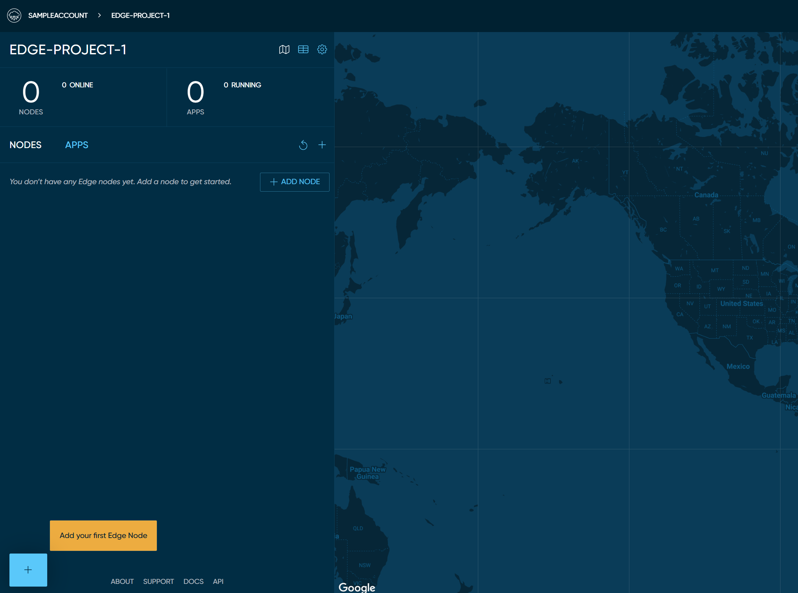

# Get Started: Darcy Cloud

## Create your Darcy Cloud account

Navigate to **Darcy Cloud** using  your browser (Chrome, Firefox and and Safari preferred, any other browsers, your mileage may vary)

Click the `Create Account` button on the top right.

Enter your unique username and hit `NEXT`.

.png>)

On the "Welcome" page, choose an auth provider or provide your own email and password.

Darcy Cloud uses Auth0 to provide secure account creation and access

 (1).png>)

.png>)

## Verify your email

You may need to check your spam folders. The email sender will be "no-reply@auth0user.net"

 (1).png>)

## View your Darcy Cloud Edge Project

Once your account has been created, Darcy Cloud automatically creates your first project. This may take a few minutes. The screen will refresh automatically when complete.

.png>)

Once your Edge project is created, you will see your project overview page and be able to **** [**add your first node!**](get-started-add-node.md)****

