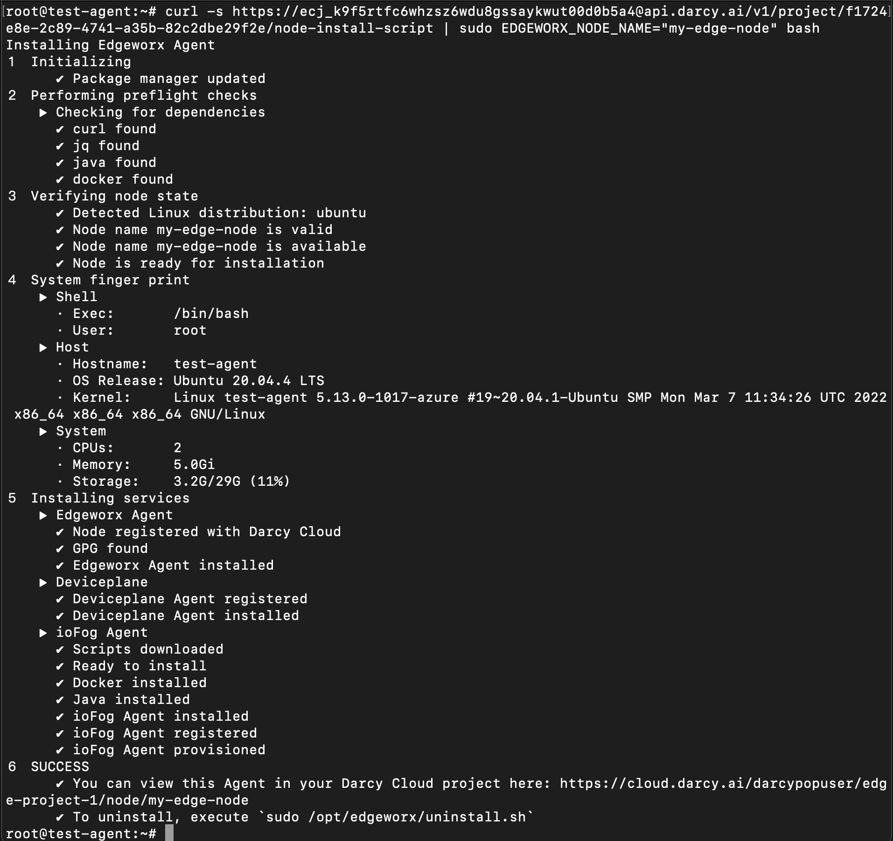

# Add an Edge Node

In order to start deploying applications via Darcy Cloud, you must add nodes to your edge project. Nodes can be an edge device such as a [**Raspberry Pi** ](https://www.raspberrypi.com)or an [**NVIDIA Jetson**](https://www.nvidia.com/en-us/autonomous-machines/jetson-store/). They can also be VMs in the Cloud or a **** [**Vagrant**](https://www.vagrantup.com) image running on your laptop. Basically any type of computer that you want to connect to your Edge project.&#x20;

## Prerequisites 

To add a node to your project, you will be running a command line script. For this we assume you have `ssh` or console access to your node and are using a common shell, such as `zsh` or `bash`. Additionally, the installation script by default will need to run as `sudo` to register the necessary services to be automatically started after the node is rebooted.

### Supported Hardware

* Raspberry Pi 3 & 4 (running Raspbian)
* Intel NUC (running Ubuntu OS)
* Google Coral Dev Boards (running Mendel Linux)

### Supported Operating Systems

* Raspbian Buster
* Ubuntu 18.04+
* Debian 10+


If you do not have any of the above hardware, you can create a VM and run the node installation script.


## Get the Node Installation Script

Log into **Darcy Cloud** and select the project to which you want to add the node.&#x20;

Click the `+ ADD NODE` button located in the panel on the left of the view. This will bring up a modal dialog which shows the one line command that must be run on your host for it to become a node in your edge project.

Click the `COPY` button to copy the install command to your clipboard.

## Run the Node Installation Script

SSH onto your host (or log in via the console) with a user that is in the sudo group.

Paste the command line that you copied in step 2 into your terminal. Hit enter. The entire install process can take up to a few minutes (depending on the spec of your node, your internet connection speed and other dependencies).&#x20;

If everything works you should see output similar to that above.

.png>)

If you would like to use your own name for the node use the variable `NODE_NAME="your-choice-of-name"` in the node install script. SSH onto your host (or log in via the console) with a user that is in the sudo group.

If you would like to use your own name for the node use the variable `NODE_NAME="your-choice-of-name"` in the node install script. SSH onto your host (or log in via the console) with a user that is in the sudo group.

Paste the command line that you copied in step 2 into your terminal. Hit enter. The entire install process can take up to a few minutes (depending on the spec of your node, your internet connection speed and other dependencies).&#x20;

Paste the command line that you copied in step 2 into your terminal. Hit enter. The entire install process can take up to a few minutes (depending on the spec of your node, your internet connection speed and other dependencies).&#x20;

If everything works you should see output similar to that above.

If everything works you should see output similar to that above.

.png>)


If you get errors, check the output or you can view the install log in `/tmp/ewc_logs.txt` for more clues as to the error. You could also try running `sudo apt update`.


## View the node in your Edge project

Switch back to your browser and if you have not, click the `DONE` button in the modal dialog. Ultimately you should see your new node `ONLINE` in your Nodes list.&#x20;


A node can be in one of these states:

* `INITIALIZING`: The node is briefly in this state when first created.
* `INSTALLING`: Software is being installed or updated on the node.
* `ONLINE`: The happy state: Darcy Cloud is receiving heartbeats from the node and services are reachable.
* `DEGRADED`: At least one of the node's services is not behaving as expected.
* `UNREACHABLE`: This means that Darcy Cloud has not received a heartbeat from the node in some time, and all services seem inaccessible. This could happen due to network outages, or if the node has been shut down, frozen, or otherwise disabled.


You now have an edge node, let's start using it!
