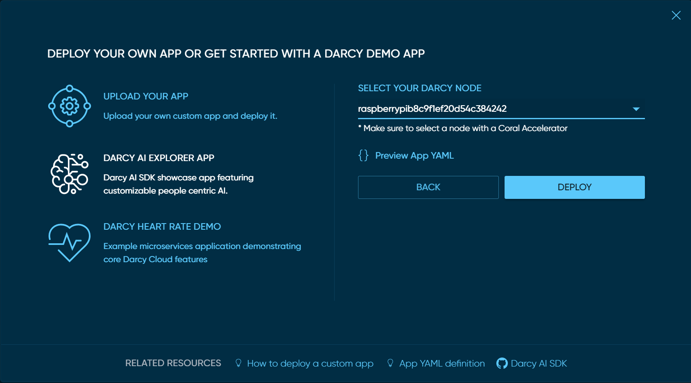
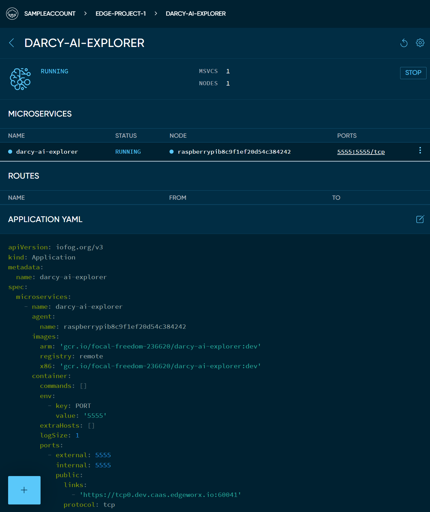

# Deploy AI Demo App

Apps are groups of microservices bundled to work together. They are defined using YAML files and can be deployed and updated by uploading those YAML files through Darcy Cloud or through [**edgectl**](../get-started-edgectl/).

## Prerequisites

To deploy the Darcy AI Explorer app, you will need:

* A Darcy Cloud Account
* Compatible ARM edge node with a Coral Accelerator
  * Raspberry Pi + Coral AI accelerator
  * Coral Dev Board
  * Coral Mini
  * Tinker T

### About the "Darcy AI Explorer" demo app

The Darcy AI Explorer is a showcase app for the Darcy AI SDK. Bootstrap your AI project using powerful face detection, pose detection, QR code scanning and more.

## Deploy the Darcy AI Explorer app using Darcy Cloud

1. Go to your Darcy Cloud project page (make sure you have [**added at least 1 node**](get-started-add-node.md))
2. Select `Apps`
3. Click on `+ DEPLOY APP`
4. Click on `DARCY AI EXPLORER`
5. Select the node where you want it to run
6. Click `DEPLOY`

&#x20;

