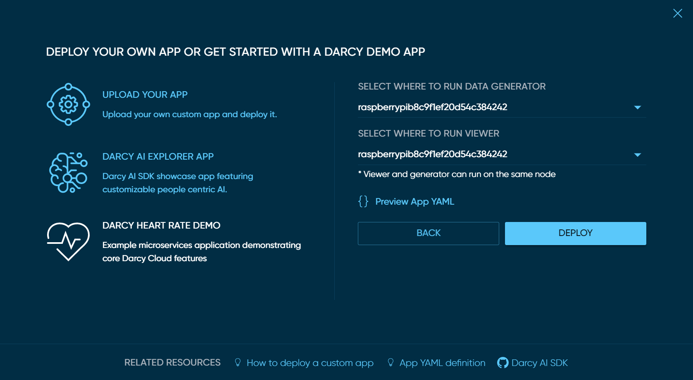
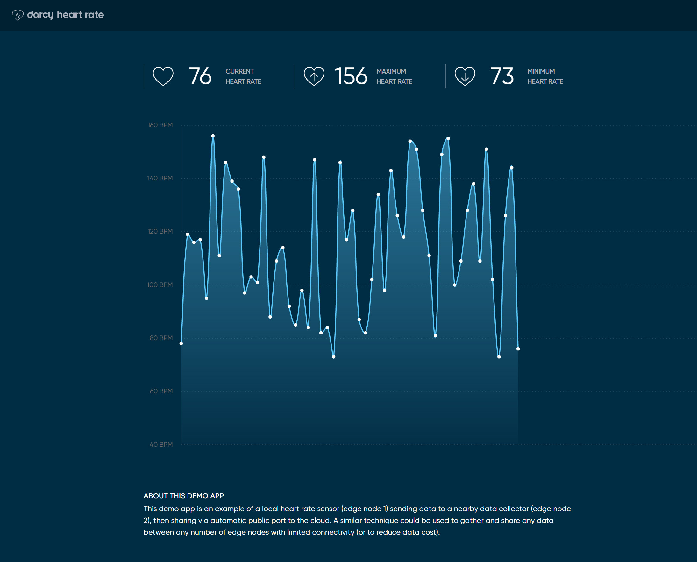

# Deploy Simple Demo App

Apps are groups of microservices bundled to work together. They are defined using YAML files and can be deployed and updated by uploading those YAML files through Darcy Cloud or through [**edgectl**](../get-started-edgectl/).

## Prerequisites

To deploy an app, you will need an Darcy Cloud account with at least one node accessible and `ONLINE`. You can deploy the demo app with no experience in YAML or application building.

### About the "Heart Rate Demo App"

The Heart Rate Demo App provided with Darcy Cloud simulates a wearable device transmitting a person's heartbeat at the Edge. The Wearable sends heart rate data over bluetooth to a data collector microservice located on Node 1. The Data collector microservice then communicates with another microservice running a web server on Node 2 to display the heart rate data on a graph.&#x20;

 (1) (1).png>)

## Deploy the Demo App using Darcy Cloud

1. Go to your Darcy Cloud project page (make sure you have [**added at least 1 node**](nodes/get-started-add-node.md))
2. Select `Apps`
3. Click on `+ DEPLOY APP`
4. Click on `DARCY HEART RATE DEMO`
5. Select the node(s) where you want it to run
6. Click `DEPLOY`



## See the results of the demo app

When your app is deployed successfully you will see an "Application Deployed" message in the top right of your screen.

If you are not already seeing the demo app listed, click the "APPS" tab to see all of the apps in your current project. Click the demo app to access the app detail view.&#x20;


From the app detail view, click the linked text under the "ports" column to navigate to the demo app output.


You should be brought to the heart rate demo app.




Although this demo app works best with two nodes, you can deploy the app with only one node and run all microservices on the same device. The demo app YAML will automatically detect if you have one or two nodes.



If you wish to know more about the demo app before deploying it, you can inspect its YAML definition by clicking on the curly brace in the modal


## YAML File

```yaml
kind: Application
apiVersion: iofog.org/v3
metadata:
  name: demo-app
spec:
  microservices:
    # Custom micro service that will connect to Scosche heart rate monitor via Bluetooth
    - name: "monitor"
      agent:
        name: "
{{ agent.name }}"
      images:
        arm: "edgeworx/healthcare-heart-rate:arm-v1"
        x86: "edgeworx/healthcare-heart-rate:x86-v1"
      container:
        rootHostAccess: false
        ports: []
      config:
        # data will be mocked
        test_mode: true
        data_label: "Anonymous Person"
    # Simple JSON viewer for the heart rate output
    - name: "viewer"
      agent:
        name: "
{{ agent.name }}"
      images:
        arm: "edgeworx/healthcare-heart-rate-ui:arm"
        x86: "edgeworx/healthcare-heart-rate-ui:x86"
      container:
        rootHostAccess: false
        ports:
          # The ui will be listening on port 80 (internal).
          - external: 5000 # You will be able to access the ui on <AGENT_IP>:5000
            internal: 80 # The ui is listening on port 80. Do not edit this.
            public:
              schemes:
              - https
              protocol: http
        volumes: []
        env:
          - key: "BASE_URL"
            value: "http://localhost:8080/data"
  routes:
    # Use this section to configure route between microservices
    # Use microservice name
    - from: "{{self.microservices[0].name}}"
      to: "{{self.microservices[1].name}}"
      name: "monitor-to-viewer"
```


