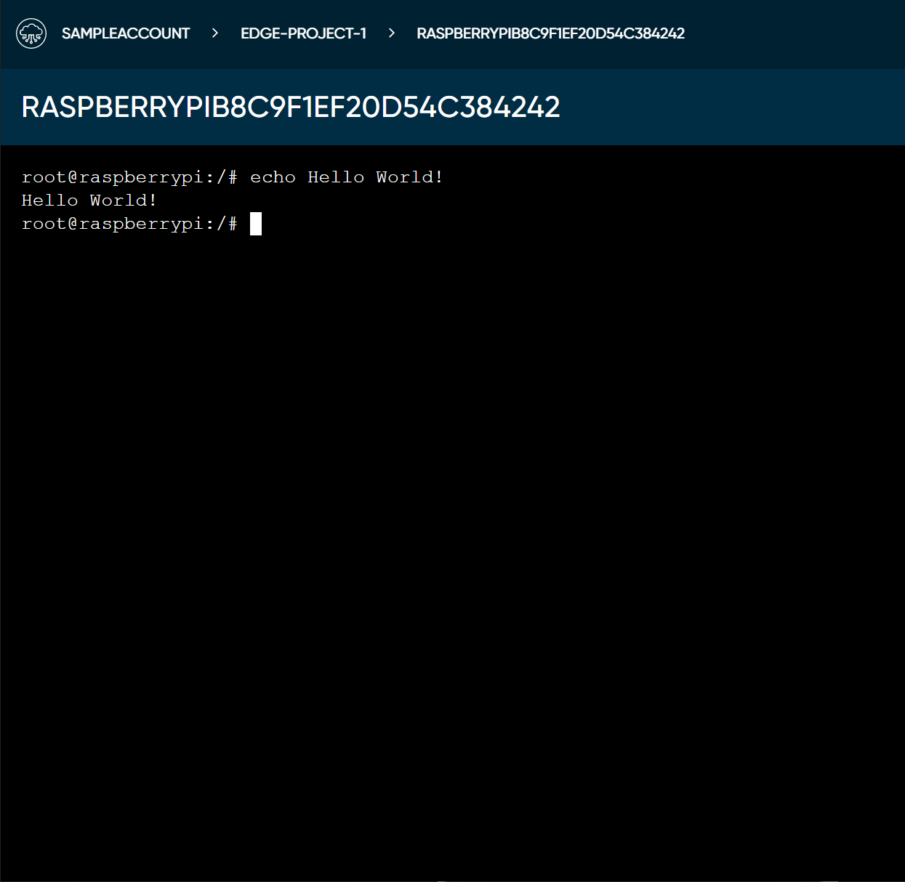

# Remotely Access Your Node

Once your node is installed and connected to Darcy Cloud, you'll be able to remotely access it using the Darcy Cloud Portal and/or [**edgectl**](../get-started-edgectl/).

## Prerequisites 

To access your node, you will need an Darcy Cloud account with at least one node accessible and `ONLINE` and some knowledge of SSH commands.

## SSH into your node

In the portal, click on any node to access the node's details page.

From here, click on the `SSH` button. This will open a new tab in your browser, after a small loading time, you'll have access to a terminal on your node.


You can also access the SSH shortcut from the project overview page by clicking the 3 dots to the right of your node and selecting "SSH" from the drop down menu.


Once your node is deployed, you're ready to [**Deploy the Demo App**](get-started-deploy-app.md).
