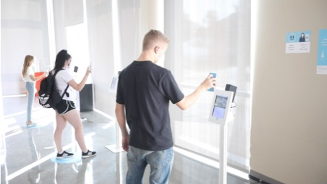
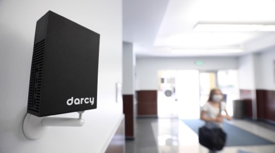

# Finding a good spot for Darcy

## Darcy can work in 2 modes: Checkin and Passby

Decide which mode is right for you and find a good spot for Darcy based on the tips below 

## Checkin mode

#### **Checkin mode ensures everyone that enters your space has been checked for fever, facemask and symptoms**

1. Install in an area that is near the main entry and is clearly visible to people entering your business
2. Install Darcy at waist to chest height and place the Darcy “stand here…” marker on the floor 3 feet away
3. Avoid pointing Darcy directly at bright areas \(heavily backlit subjects are more difficult for Darcy to see\) 4 Average check in time per person is 1-2 seconds \(assuming they filled out their Darcy Pass previously\) 

## Pass-through mode

**Pass-through mode passively monitors your space for fevers and face masks as people approach Darcy**

1. Install in an area where Darcy has the best view of people’s faces as they approach and walk by
2. Optimum operating distance is 3’-10’ \(depending on environmental conditions, visitors may need to pause for a moment while in range\) 
3. Avoid pointing Darcy directly at bright areas \(heavily backlit subjects are more difficult for Darcy to see\)

