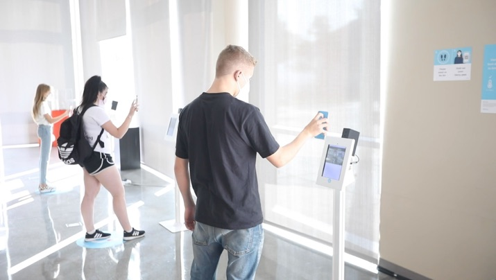

# Getting Started using Darcy Pass

## One Time

1. **Get the Darcy Fast Pass app or visit the website**
   1. Search your App Store for “Darcy Fast Pass”
   2. Or visit “https://meetdarcy.app” for the website

### Creating your first Darcy Pass

## Daily- Using your Darcy Pass

1. **Create your Darcy Fast Pass for the day**
   1. Fill out the daily questionnaire
   2. Darcy will generate your Fast Pass with a QR code
2. **Show your Darcy Fast Pass on entry**
   1. Bring up your Darcy Fast Pass \(QR code\) on your phone or tablet
   2. Show it to Darcy: Stand on the big blue dot and hold your phone out so Darcy can see the QR code

