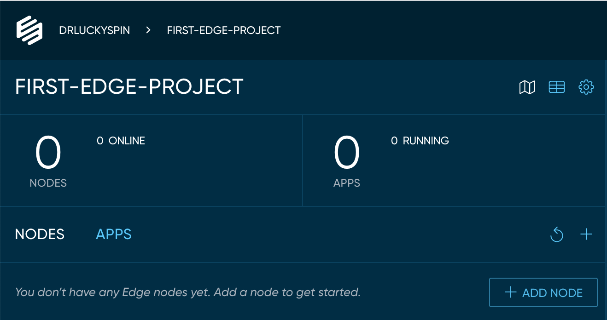
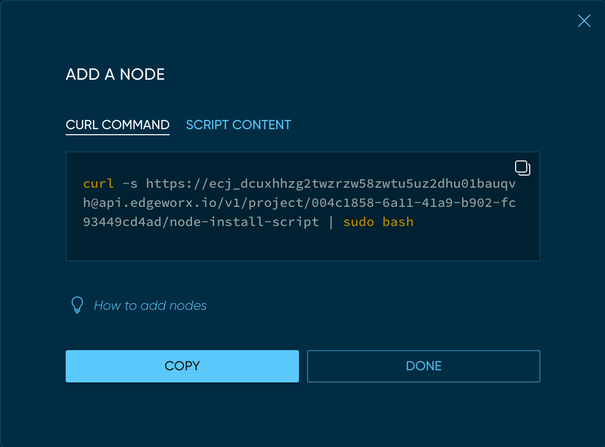
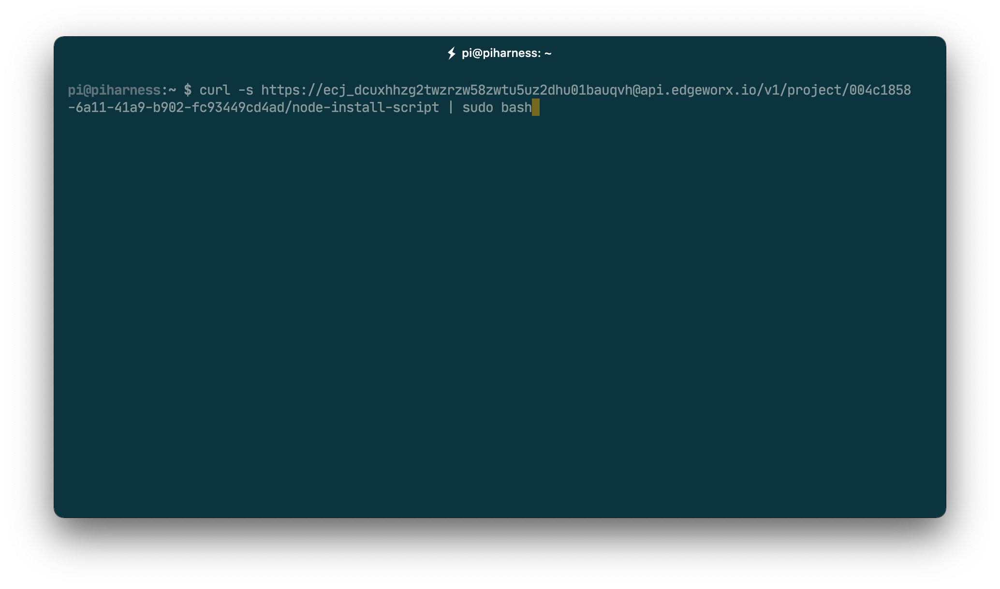
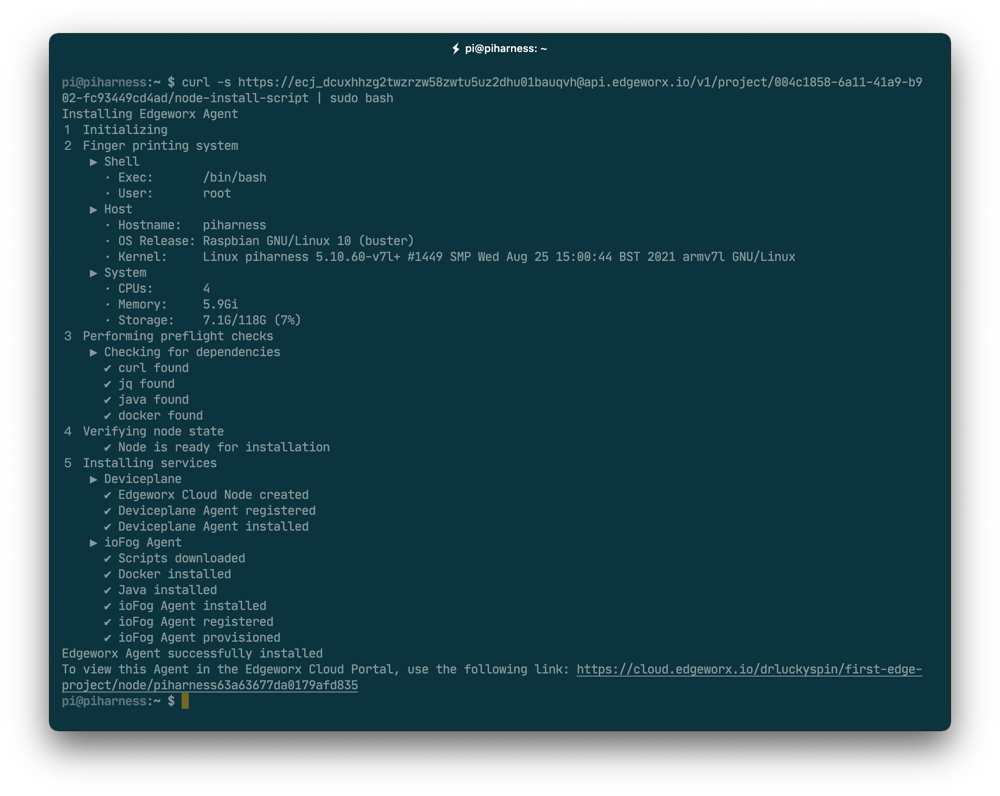
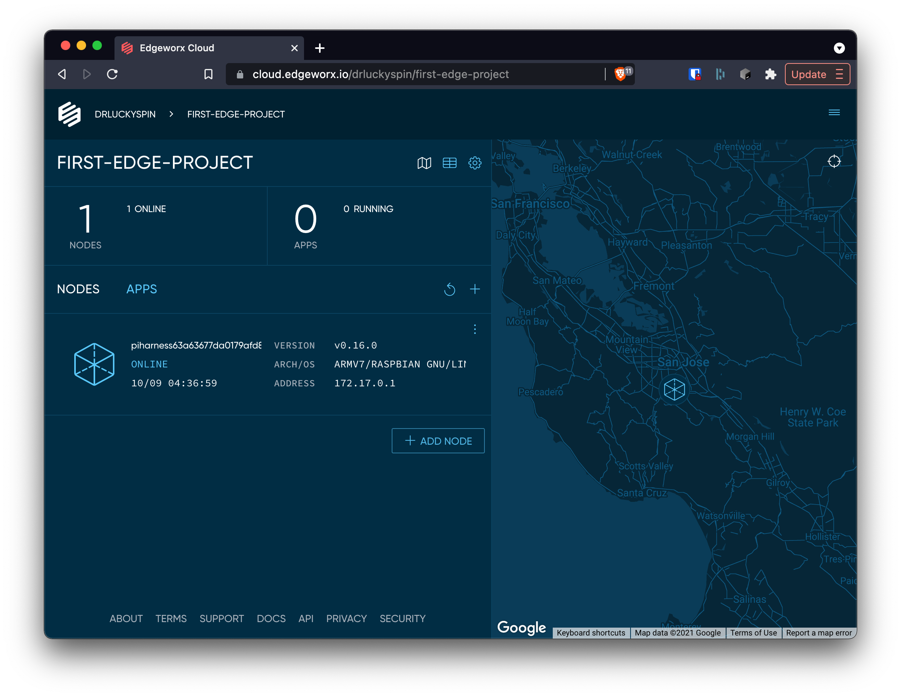

# Add an Edge Node

In order to start deploying applications via Edgeworx Cloud, you must add nodes to your edge project. Nodes can be an edge device such as a [Raspberry Pi ](https://www.raspberrypi.com)or an [NVIDIA Jetson](https://www.nvidia.com/en-us/autonomous-machines/jetson-store/). They can also be VMs in the Cloud or a [Vagrant](https://www.vagrantup.com) image running on your laptop. Basically any type of computer that you want to connect to your Edge project. The list of supported devices and OSs can be [found here](http://www.nohost.com).

The following sections explain how to add edge nodes to your projects.

## 1. Prerequisites 

To add a node to your project, you will be running a command line script. For this we assume you have `ssh` or console access to your node and are using a common shell, such as `zsh` or `bash`. Additionally, the installation script by default will need to run as `sudo` to register the necessary services to be automatically started after the node is rebooted.

## 2. Get the Node Installation Script

Log into [Edgeworx Cloud](http://cloud.edgeworx.io) and select the project to which you want to add the node. 

Click the `+ ADD NODE` button located in the panel on the left of the view. This will bring up a modal dialog which shows the one line command that must be run on your host for it to become a node in you edge project.

Click the `COPY` button to copy the install command to your clipboard.

## 3. Run the Node Installation Script

SSH onto your host (or log in via the console) with a user that is in the sudo group.

Paste the command line that you copied in step 2 into your terminal. Hit enter. The entire install process can take several minutes (depending on the spec of your node and your internet connection speed). 

If everything works you should see output similar to that above. If an error occurs, check the output or, you can view the install log in `/tmp/ewc_logs.txt` for more clues as to the error.

## 4. View the node in your Edge project

Switch back to your browser and if you have not, click the `DONE` button in the modal dialog. You should see your new node `ONLINE` in your Nodes list. 

If it is not showing, try refreshing the page in your browser, or use the refresh button to reload the list of nodes. If the status is not showing as `ONLINE` try clicking on the node to drill in and see more details, or check the `/tmp/ewc_logs.txt` file on your node for any errors that may have happened during the installation process.

You now have an edge node, let's start using it!
